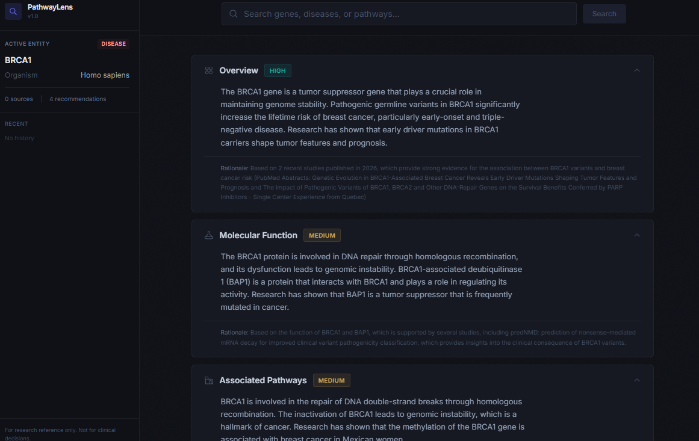
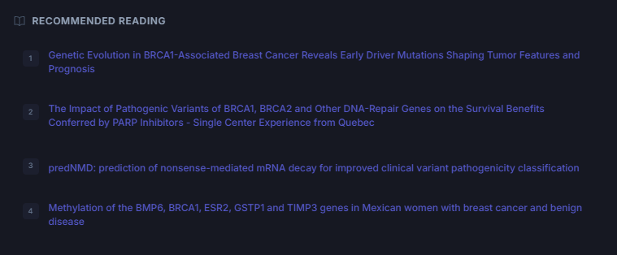

# PathwayLens

[](https://github.com/shaurya202/pathwaylens/actions/workflows/ci.yml)
[](./LICENSE)

A desktop research assistant for querying biological entities and fetching structured summaries from curated research databases.

## Overview

PathwayLens helps researchers quickly gather and synthesize information about genes, diseases, and pathways from multiple authoritative sources:

- **NCBI** — Gene data and PubMed literature
- **UniProt** — Protein function and annotations
- **Ensembl** — Gene structure and genomic context
- **Reactome** — Biological pathway data

Queries are resolved in parallel, then synthesized into structured summaries with confidence ratings and source citations.




## Prerequisites

- [Node.js](https://nodejs.org/) 18 or higher
- npm 9 or higher
- [NVIDIA NIM API key](https://build.nvidia.com/) (free tier available)

## Development

```bash
npm install
npm run dev
```

## Commands

| Command | Description |
|---------|-------------|
| `npm run dev` | Start dev server |
| `npm run build` | Build all processes |
| `npm run build:win` | Package Windows installer |
| `npm run build:mac` | Package macOS DMG |
| `npm run build:linux` | Package Linux AppImage/deb/rpm |
| `npm run test` | Run tests |
| `npm run test:watch` | Run tests in watch mode |

## Environment

Create a `.env` file at the project root:

```
NIM_API_KEY=your-nvidia-nim-api-key
NCBI_API_KEY=your-ncbi-api-key (optional, for higher rate limits)
```

## Project Structure

```
src/
├── main/           # Electron main process
│   ├── apis/       # External API clients (NCBI, UniProt, Ensembl, Reactome)
│   ├── nim.ts      # NVIDIA NIM synthesis client
│   ├── cache.ts    # Query result caching
│   └── ipc.ts      # IPC handlers
├── preload/        # Context bridge
├── renderer/       # React UI
│   ├── components/ # SearchBar, Sidebar, SummaryPanel, SourceCard, WhatToReadNext
│   └── stores/     # Zustand state
└── shared/         # Types used across processes
```

## Contributing

Contributions are welcome. To get started:

1. Fork the repository
2. Create a branch (`git checkout -b feature/my-feature`)
3. Make your changes
4. Run `npm run test` to verify
5. Commit and push
6. Open a pull request

If you find a bug or have a feature request, please open an issue.

## License

[MIT](./LICENSE)
